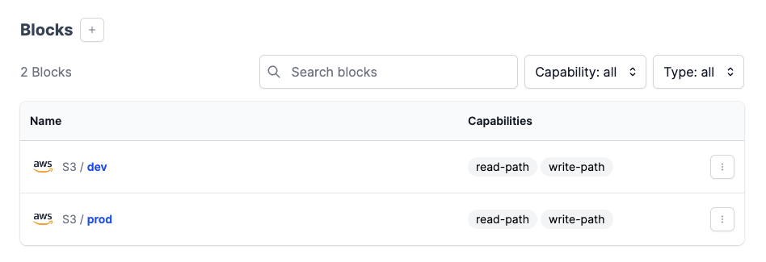

# Prefect Orion AWS CI/CD Github action

## Description

This recipe shows you how to set up a basic CI/CD pipeline for your prefect flows. Because Prefect stores your code data when you build a deployment, this recipe syncs your repo to your prefect storage. It assumes that you are using S3 storage blocks for your storage and consists of two github actions YAML files for two seperate enviroments.

## Usage

When using S3 as the storage for your flows, keeping your flow code synced to your storage is very simple.Let's say we have two enviroments, prod and dev, that each have their own storage block:



We can create a deployment for each one of our enviroments in out terminal with the following:

```sh
prefect deployment build ./flow_file.py:flow_function_name -n prod --tag prod --storage-block s3/prod

prefect deployment build ./flow_file.py:flow_function_name -n dev --tag dev --storage-block s3/dev
```

After applying building the deployments, our flow code will be stored inside of our respective storage blocks. Now in order to streamline your flow development all you have to do is sync your flow repository in this case Github, to our s3 bucket holding our flow data.

In the root of you flow directory, you can copy and paste the two GH actions to sync your repo to s3. They use the s3-sync action to sync the repo on a push to each respective branch. In a repo with a protected main branch this will only sync the repo to the prod enviroment after a review and merge request happens in Github.

### Action Parameters

| Parameter             | Description |
| -----------           | ----------- |
| args                  | S3 sync flags. Excluding dot directories like .git and your enviroment reccomended    |
| AWS_S3_BUCKET         | S3 bucket used for storage blocks       |
| AWS_ACCESS_KEY_ID     | AWS creds       |
| AWS_SECRET_ACCESS_KEY | AWS creds       |
| DEST_DIR              | This will be match the name of our block i.e s3/prod will be '/prod'           |
