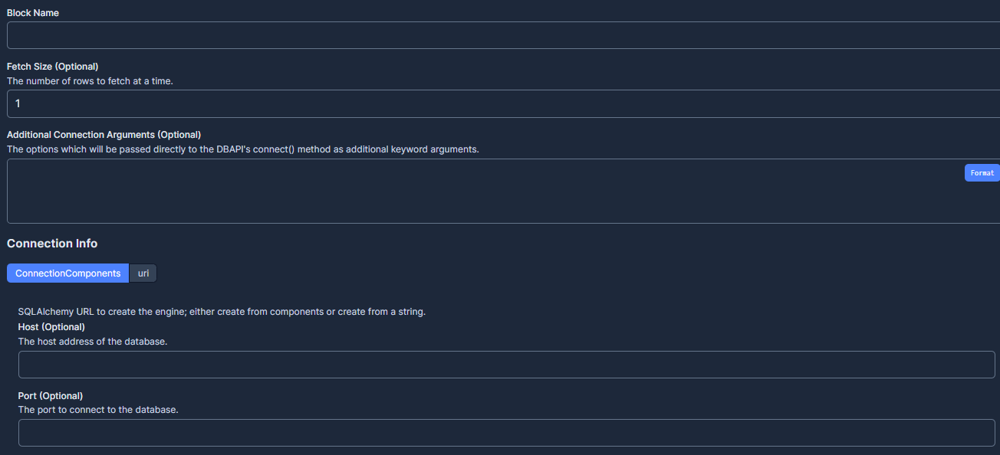

# Prefect-SQLAlchemy

This recipe demonstrates how to integrate prefect with SQL Alchemy.The prefect-sqlalchemy collection makes it easy to connect to a database in your Prefect flows.

## Getting Started

These instructions were tested with Python 3.11, but should also work from Python 3.7 and up.

### Installation

Install `prefect-sqlalchemy` with `pip`:

```bash
pip install prefect-sqlalchemy
```

Requires an installation of Python 3.7+.

We recommend using a Python virtual environment manager such as pipenv, conda or virtualenv.

These tasks are designed to work with Prefect 2.0. For more information about how to use Prefect, please refer to the [Prefect documentation](https://orion-docs.prefect.io/).

### Registering blocks
Register blocks in this module to  [view and edit them](https://orion-docs.prefect.io/ui/blocks/) on Prefect Cloud:   
```bash
prefect block register -m prefect_sqlalchemy
```

A list of available blocks in `prefect-sqlalchemy` and their setup instructions can be found [here](https://PrefectHQ.github.io/prefect-sqlalchemy/blocks_catalog).

### Adding SQLAlchemy Connector Block through UI

Step 1: Head to Blocks


Step 2: Type SQL in the search space and choose add SQLAlchemy Connector.


Step 3: Fill in the required Details and create.



### Saving Credentials to Block

To use the `load` method on Blocks, you must already have a block document [saved through code](https://orion-docs.prefect.io/concepts/blocks/#saving-blocks) or [saved through the UI](https://orion-docs.prefect.io/ui/blocks/).

Below is a walkthrough on saving block documents through code; simply create a short script, replacing the placeholders. 

```python
from prefect_sqlalchemy import SqlAlchemyConnector, ConnectionComponents, SyncDriver

connector = SqlAlchemyConnector(
    connection_info=ConnectionComponents(
        driver=SyncDriver.POSTGRESQL_PSYCOPG2,
        username="USERNAME-PLACEHOLDER",
        password="PASSWORD-PLACEHOLDER",
        host="localhost",
        port=5432,
        database="DATABASE-PLACEHOLDER",
    )
)

connector.save("BLOCK_NAME-PLACEHOLDER")
```

Congrats! You can now easily load the saved block, which holds your credentials:

```python
from prefect_sqlalchemy import SqlAlchemyConnector

SqlAlchemyConnector.load("BLOCK_NAME-PLACEHOLDER")
```

The required keywords depend on the desired `driver`. For example, sqlite only requires driver and database specified:

```python
from prefect_sqlalchemy import SqlAlchemyConnector, ConnectionComponents, SyncDriver

connector = SqlAlchemyConnector(
    connection_info=ConnectionComponents(
        driver=SyncDriver.SQLITE_PYSQLITE,
        database="DATABASE-PLACEHOLDER.db"
    )
)

connector.save("BLOCK_NAME-PLACEHOLDER")
```

### Integrate with Prefect flows

Prefect and SQLAlchemy are a data powerhouse duo. With Prefect, your data pipelines are always on track, and with SQLAlchemy, your databases are a snap to handle! Get ready to experience the ultimate data "flow-chemistry"!

To set up a table, use the  `execute`  and  `execute_many`  methods. Then, use the  `fetch_many`  method to retrieve data in a stream until there's no more data.

By using the  `SqlAlchemyConnector`  as a context manager, you can make sure that the SQLAlchemy engine and any connected resources are closed properly after you're done with them.

Be sure to install  [prefect-sqlalchemy](https://prefecthq.github.io/prefect-sqlalchemy/#installation)  and  [save to block](https://prefecthq.github.io/prefect-sqlalchemy/#saving-credentials-to-block)  to run the examples below!

Async support
`SqlAlchemyConnector`  also supports async workflows! Just be sure to save, load, and use an async driver.

```python
from prefect_sqlalchemy import SqlAlchemyConnector, ConnectionComponents, AsyncDriver

connector = SqlAlchemyConnector(
    connection_info=ConnectionComponents(
        driver=AsyncDriver.SQLITE_AIOSQLITE,
        database="DATABASE-PLACEHOLDER.db"
    )
)

connector.save("BLOCK_NAME-PLACEHOLDER") 
```

Sync

```python
from prefect import flow, task
from prefect_sqlalchemy import SqlAlchemyConnector

@task
def setup_table(block_name: str) -> None:
    with SqlAlchemyConnector.load(block_name) as connector:
        connector.execute(
            "CREATE TABLE IF NOT EXISTS customers (name varchar, address varchar);"
        )
        connector.execute(
            "INSERT INTO customers (name, address) VALUES (:name, :address);",
            parameters={"name": "Marvin", "address": "Highway 42"},
        )
        connector.execute_many(
            "INSERT INTO customers (name, address) VALUES (:name, :address);",
            seq_of_parameters=[
                {"name": "Ford", "address": "Highway 42"},
                {"name": "Unknown", "address": "Highway 42"},
            ],
        )

@task
def fetch_data(block_name: str) -> list:
    all_rows = []
    with SqlAlchemyConnector.load(block_name) as connector:
        while True:
            # Repeated fetch* calls using the same operation will
            # skip re-executing and instead return the next set of results
            new_rows = connector.fetch_many("SELECT * FROM customers", size=2)
            if len(new_rows) == 0:
                break
            all_rows.append(new_rows)
    return all_rows

@flow
def sqlalchemy_flow(block_name: str) -> list:
    setup_table(block_name)
    all_rows = fetch_data(block_name)
    return all_rows

sqlalchemy_flow("BLOCK-NAME-PLACEHOLDER")
```


Async

```python
from prefect import flow, task
from prefect_sqlalchemy import SqlAlchemyConnector
import asyncio

@task
async def setup_table(block_name: str) -> None:
    async with await SqlAlchemyConnector.load(block_name) as connector:
        await connector.execute(
            "CREATE TABLE IF NOT EXISTS customers (name varchar, address varchar);"
        )
        await connector.execute(
            "INSERT INTO customers (name, address) VALUES (:name, :address);",
            parameters={"name": "Marvin", "address": "Highway 42"},
        )
        await connector.execute_many(
            "INSERT INTO customers (name, address) VALUES (:name, :address);",
            seq_of_parameters=[
                {"name": "Ford", "address": "Highway 42"},
                {"name": "Unknown", "address": "Highway 42"},
            ],
        )

@task
async def fetch_data(block_name: str) -> list:
    all_rows = []
    async with SqlAlchemyConnector.load(block_name) as connector:
        while True:
            # Repeated fetch* calls using the same operation will
            # skip re-executing and instead return the next set of results
            new_rows = await connector.fetch_many("SELECT * FROM customers", size=2)
            if len(new_rows) == 0:
                break
            all_rows.append(new_rows)
    return all_rows

@flow
async def sqlalchemy_flow(block_name: str) -> list:
    await setup_table(block_name)
    all_rows = await fetch_data(block_name)
    return all_rows

asyncio.run(sqlalchemy_flow("BLOCK-NAME-PLACEHOLDER")) 
```
