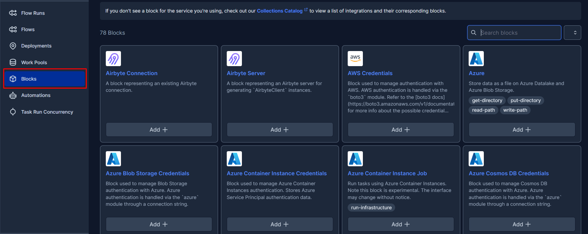
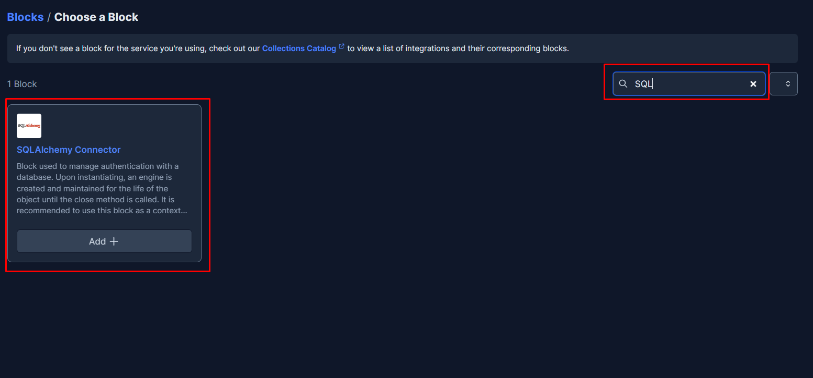
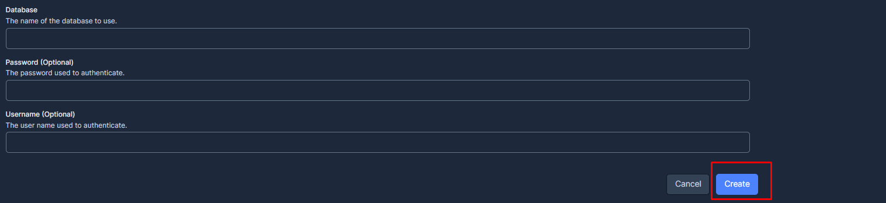

# Prefect-SQLAlchemy

This recipe demonstrates how to integrate Prefect with SQLAlchemy. The prefect-sqlalchemy collection makes it easy to connect to a database in your Prefect flows.

## Getting Started

These instructions were tested with Python 3.11, but should also work from Python 3.7 and up.

### Installation

Install `prefect-sqlalchemy` with `pip`:

```bash
pip install prefect-sqlalchemy
```

Requires an installation of Python 3.7+.

We recommend using a Python virtual environment manager such as pipenv, conda or virtualenv.

These tasks are designed to work with Prefect 2.0. For more information about how to use Prefect, please refer to the [Prefect documentation](https://orion-docs.prefect.io/).

### Registering blocks
Register blocks in this module to  [view and edit them](https://orion-docs.prefect.io/ui/blocks/) on Prefect Cloud:   
```bash
prefect block register -m prefect_sqlalchemy
```

A list of available blocks in `prefect-sqlalchemy` and their setup instructions can be found [here](https://PrefectHQ.github.io/prefect-sqlalchemy/blocks_catalog).

### Adding SQLAlchemy Connector Block through UI

Step 1: Head to Blocks


Step 2: Type SQL in the search space and choose add SQLAlchemy Connector.


Step 3: Fill in the required Details and create.




More instructions and examples on SQL-Alchemy can be found at [here](https://prefecthq.github.io/prefect-sqlalchemy/)